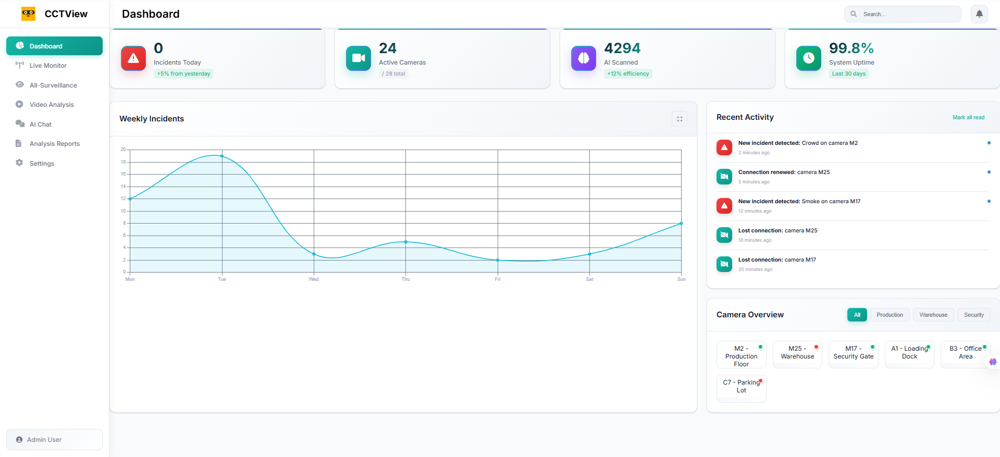
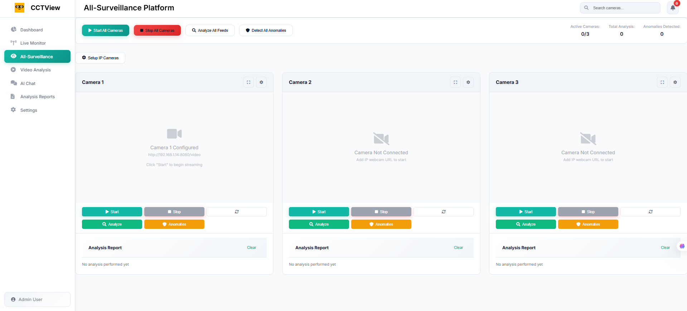
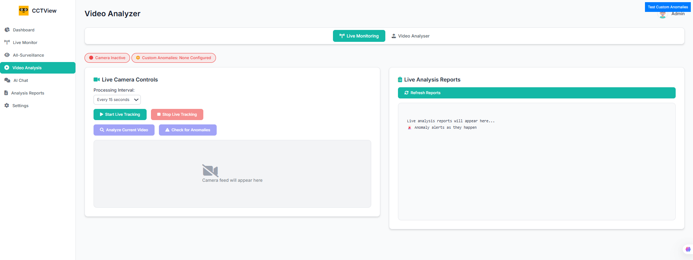
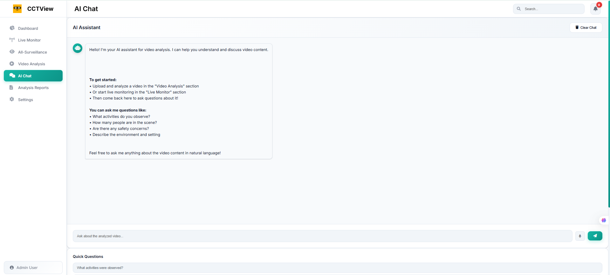
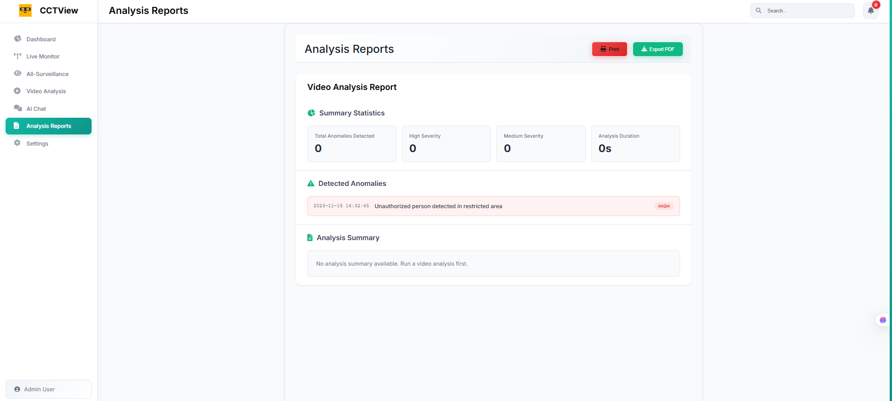
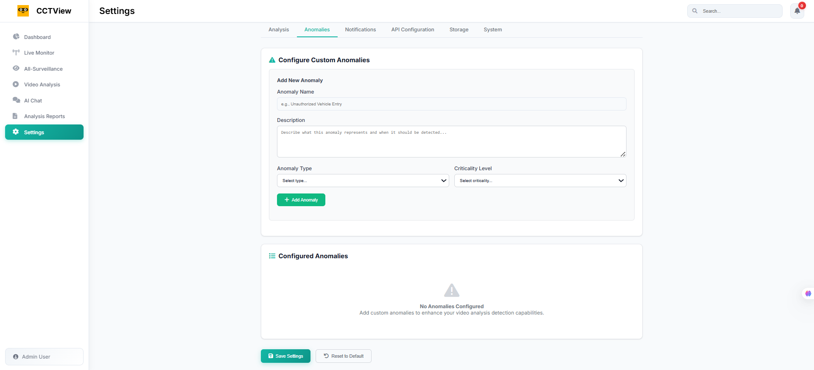

# CCTView - AI-Powered Video Analysis Dashboard

A comprehensive surveillance platform that combines real-time video monitoring with advanced AI-powered anomaly detection and analysis capabilities.


## 🌟 Overview

CCTView is a modern surveillance dashboard that provides real-time monitoring, AI-powered video analysis, and comprehensive incident reporting. The system supports multiple camera feeds and uses advanced machine learning algorithms to detect anomalies and security incidents.

## 📸 Screenshots

### Dashboard Overview

*Real-time monitoring with incident tracking, camera management, AI analytics, and system health metrics showing 99.8% uptime*

### All-Surveillance Platform

*Multi-camera management interface with live feed controls, camera status indicators, and real-time analysis capabilities*

### AI Video Analysis

*AI-powered video processing with live camera controls, custom anomaly detection, and real-time analysis reports*

### AI Chat Assistant

*Interactive AI assistant for video analysis with natural language queries and context-aware responses*

### Analysis Reports

*Comprehensive reporting dashboard with anomaly detection summaries, statistics, and export capabilities*

### Settings & Configuration

*Advanced configuration panel for custom anomaly setup, criticality levels, and system preferences*

## 🚀 Features

### 📊 Dashboard
- **Real-time Monitoring**: Live incident tracking with visual trends
- **Camera Management**: Support for 24+ simultaneous camera feeds
- **AI Analytics**: 4294 AI scans with +12% efficiency improvement
- **System Health**: 99.8% uptime over the last 30 days
- **Weekly Reports**: Incident analytics with interactive charts

### 🎥 Surveillance System
- **Multi-Camera Support**: Manage multiple IP camera feeds
- **Live Feed Control**: Start/stop streaming with one click
- **Camera Status**: Real-time connection and health monitoring
- **RTSP/HTTP Support**: Compatible with standard IP cameras
- **Scalable Architecture**: Easy addition of new camera sources

### 🤖 AI-Powered Analysis
- **Real-time Processing**: Continuous video analysis every 15 seconds
- **Custom Anomaly Detection**: Configure specific incident types
- **Smart Alerts**: Automated notifications for detected anomalies
- **Live Tracking**: Real-time incident detection and logging
- **Performance Monitoring**: Analysis duration and efficiency tracking

### 💬 AI Assistant
- **Natural Language Queries**: Ask questions about video content
- **Interactive Analysis**: "What activities do you observe?"
- **Context-Aware Responses**: AI understands video scenes
- **Analysis Guidance**: Help with monitoring workflows
- **Quick Questions**: Pre-built queries for common scenarios

### 📈 Reporting & Analytics
- **Comprehensive Reports**: Detailed analysis summaries with statistics
- **Anomaly Tracking**: Incident detection with severity levels
- **Export Options**: Print and PDF export capabilities
- **Time-based Analysis**: Duration tracking and trend analysis
- **Custom Metrics**: Configurable KPIs and monitoring parameters

### ⚙️ Configuration
- **Custom Anomaly Setup**: Define specific detection scenarios
- **Severity Levels**: Configure high/medium/low criticality
- **Flexible Detection**: Adaptable to various environments
- **User Management**: Role-based access control
- **API Integration**: RESTful API for external integrations

## 🛠 Technology Stack

Based on the interface and functionality shown:

- **Frontend**: Modern web interface with responsive design
- **Backend**: Real-time processing engine
- **AI/ML**: Computer vision and anomaly detection algorithms
- **Database**: Time-series data storage for analytics
- **Camera Integration**: RTSP/HTTP streaming support
- **Real-time Communication**: WebSocket for live updates

## 📋 Prerequisites

- Node.js (v14 or higher)
- Python 3.8+ (for AI analysis)
- Database system (PostgreSQL/MongoDB recommended)
- IP cameras with RTSP/HTTP support
- Sufficient bandwidth for multiple video streams

## 🚀 Installation

1. **Clone the repository**
   ```bash
   git clone https://github.com/shivoshita/video-analysis-dashboard.git
   cd video-analysis-dashboard
   ```

2. **Install dependencies**
   ```bash
   npm install
   # or
   pip install -r requirements.txt
   ```

3. **Configure environment**
   ```bash
   cp .env.example .env
   # Edit .env with your camera URLs and API keys
   ```

4. **Start the application**
   ```bash
   npm start
   # or
   python app.py
   ```

5. **Access the dashboard**
   Open your browser and navigate to `http://localhost:3000`

## 🔧 Configuration

### Camera Setup
```json
{
  "cameras": [
    {
      "id": "M2",
      "name": "Production Floor",
      "url": "rtsp://camera-ip:554/stream",
      "location": "Production",
      "enabled": true
    }
  ]
}
```

### Anomaly Detection
```json
{
  "anomalies": [
    {
      "name": "Unauthorized Person",
      "description": "Detect unauthorized access to restricted areas",
      "type": "person_detection",
      "criticality": "high"
    }
  ]
}
```

## 📡 API Endpoints

- `GET /api/cameras` - List all cameras
- `POST /api/cameras/start` - Start camera stream
- `GET /api/incidents` - Get incident reports
- `POST /api/analysis/start` - Start AI analysis
- `GET /api/reports` - Generate analysis reports

## 🔍 Usage

1. **Setup Cameras**: Configure your IP cameras in the All-Surveillance section
2. **Start Monitoring**: Begin live monitoring and AI analysis
3. **Configure Anomalies**: Set up custom detection rules in Settings
4. **Review Reports**: Check Analysis Reports for detailed insights
5. **Chat with AI**: Use the AI Assistant for interactive analysis

## 📊 Monitoring Features

- **Live Dashboard**: Real-time incident tracking
- **Camera Health**: Monitor connection status and performance
- **AI Efficiency**: Track analysis performance and accuracy
- **Historical Data**: 30-day trend analysis and reporting
- **Alert System**: Immediate notifications for critical incidents

## 🤝 Contributing

1. Fork the repository
2. Create a feature branch (`git checkout -b feature/AmazingFeature`)
3. Commit your changes (`git commit -m 'Add some AmazingFeature'`)
4. Push to the branch (`git push origin feature/AmazingFeature`)
5. Open a Pull Request

## 📝 License

This project is licensed under the MIT License - see the [LICENSE](LICENSE) file for details.

## 🆘 Support

- **Documentation**: Check the wiki for detailed guides
- **Issues**: Report bugs and request features via GitHub issues
- **Discussions**: Join the community discussions for help and ideas

## 🏆 Acknowledgments

- Computer vision algorithms for real-time analysis
- Open source libraries for video processing
- Community contributions and feedback

---

**CCTView** - Empowering surveillance with AI-driven insights 🎯
